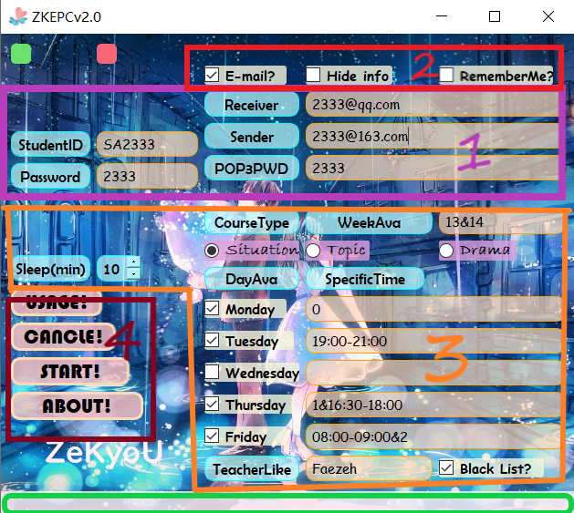

# 使用说明

本文档为EPC超智能抢课软件[ZKEPC](https://zekyou.github.io)的使用说明。

使用版本：2.0

主要功能：EPC无人值守自动选课，邮件通知等

1. 自定义空余时间(精确到分钟)
2. 自定义老师，支持黑名单和白名单模式
3. 记忆功能，方便多次操作
4. 开源，无后门，安全
5. ......

# <a id='link'>度盘链接</a>

[下载链接](https://pan.baidu.com/s/12EjhQBx4JLCM8Cf6KSGsqQ)

提取码：sucb

## 主界面

打开	**EPC.exe**	可进入界面如下：

主要分为四块区域

1. 基本信息区(主要包括学号，EPC登录码，如果需要邮件通知，还需要邮件发送方地址，发送方登录码，接收方地址)

2. 辅助功能区(包括是否需要提供邮件通知功能，是否在界面隐藏账号密码，是否本地记住''我'')

3. 选课信息区(包括所需课程种类，意愿教学周，意愿星期，以及该星期当天的空闲时间，(不)意愿老师，搜索间隔)

4. 按键执行区（包括使用说明，取消搜索，开始搜索，关于软件(作者))

   绿色为状态栏，提供一些有用信息

## 基本信息区

- **StudentID**: 填写学号
- **Password**: 填写EPC登录码

如果需要邮件提醒你，提醒是指，在选到你所要求的课程后，发邮件给你，并告诉你选课的名字，老师，时间，房间号等信息，比较好用，建议勾选。如果勾选，需要填写

- **Receiver**: 填写你的接收邮件地址（一般为自己的QQ邮箱）。
- **Sender**: 填写你发邮件的地址(目前仅支持QQ和网易163服务器)。**Notes:** 该邮箱需要开通**POP3/SMTP**服务，可以参考网上教程(百度一堆)，也可参考本文档附录。鉴于邮箱可以*自己给自己发邮件*，所以理论上只需**一个**邮箱。
- **POP3PWD**: 填写发送邮件的邮箱POP3/SMTP登录码**(注意：非登录密码)**，获取过程也可参考[附录](#appendix)提供的本地网页。

## 辅助功能区

- **E-mail?**：勾选是否开启邮件通知服务(建议开启)
- **Hide info**: 隐藏信息，效果如下：

- **RememberMe?**：勾选是否记住我，鉴于个人具体信息填写有时候较多，每次填写耗时。该选项可以生成**本地**缓存，下次启动软件时读取缓存文档，便于修改。

  该选项还可以**取消勾选**，则会删除**本地**缓存（见状态栏提示）

  **Notes：**不过注意，当你将该软件**打包**给他人时，一定先取消勾选或者手动删除缓存文件

## 选课信息区

- **Sleep(min):** 选择搜索EPC课程的时间间隔，分钟为单位，建议**不要过短**，以免给服务器带来压力。

- **CourseType:** 想要选的课程种类，包括Situation(1学分),Topic(2学分),Drama(2学分)。

- **WeekAva:** 想要选的课程教学周，支持多选，例如：我13周和14周都可以，那么填写    13&14  。同理，13&14&15代表13、14、15周都可以。

  **如果不填或者填0，则代表全部都可以接收**

- **DayAva:** 你星期几有空，就勾选星期几。

- **SpecificTime:** 你所选的星期里，具体什么时间有空。例如：我**星期一**下午14:00-17:30有空，则填写如下：

  

  **注意两点**，必须是hh:mm-hh:mm格式，**例如8点半需写为：08:30而不是8:30,** 冒号必须是英文的冒好而不是全角，即是**:**而不是**：**。中间是小短线。

  同样，该选项支持并列，例如我星期二的上午08:30-11:30和下午15:30-17:30以及晚上19:00-21:00有空，则你可以填写如下：

  

  为了方便起见，支持表达式如下：

  - **0或者不填**，则默认全天有空
  - **1**代表**上午**有空(08:00-12:00)
  - **2**代表**下午**有空(14:00-18:30)
  - **3**代表**晚上**有空(19:00-22:00)

  例如，我**星期三**全天有空，星期四上午和晚上20:00-22:00有空，则填写如下：

  

- **TeacherAva：** 选择你所喜爱的老师，则只会选择该老师的课程。例如，我只喜欢上Beata的课，则填写如下：

  

  支持并列，例如，我只想上Beata和Heiko的课，填写  Beata&Heiko即可

  支持**反选**，例如，我不想上xxx的课，则不会选择xxx的课，只需**勾选右边选项**。

- **Black List?** 是否启用黑名单模式，即上文提到的，例如：我不想上xxx和yyy的课，填写如下

  

  

  **Notes:** **注意**老师的名字**必须**填对，**大小写和字母**要一致，**例如beata不对，Beate也不对**。

## 按键执行区

- **Usage:**  打开本地使用说明网页
- **Cancel：**取消搜索
- **Start:** 开始搜索
- **About：**关于，打开GitHub的源码链接。

## 细节说明

1. 基本所有的可选框都支持**并列**，使用符号&

2. 左上红绿按钮暂无实际用途

3. **状态栏**会提供很多**错误信息**，注意查看

4. 虽然程序有很多异常处理机制，还是希望使用者按照步骤来，**输入合法字符**，注意大小写和中英文切换

5. 如果遇到闪退，可以尝试**重开程序**

6. **如遇各种BUG**或者你有好的**想法和需求**，可以联系作者。

7. 作者:ZeKyoU

   邮箱：zekyou@qq.com

## 声明

1. 本程序无任何后门，**开源**可查，安全
2. 本程序完全免费，无任何收费版本
3. **不得将本程序进行商业化用途**
4. **恶意**修改或是使用造成的后果概不负责
5. 如果你觉得好用，可以**推广给他人**，感激不尽，推广建议使用百度盘[链接](#link)

## 致谢

感谢*JX_W*和*QG*参与程序的调试，提供宝贵的经验，ZeKyoU感激不尽。

# <a id='appendix'>附录</a>

## 如何开始邮箱POP3/SMTP服务

### QQ邮箱

本地链接如下：[我是链接](https://jingyan.baidu.com/article/425e69e61e9178be15fc168a.html)

### 163邮箱

本地链接如下：[我是链接](https://jingyan.baidu.com/article/7f41ecec3e8d35593d095c93.html)
